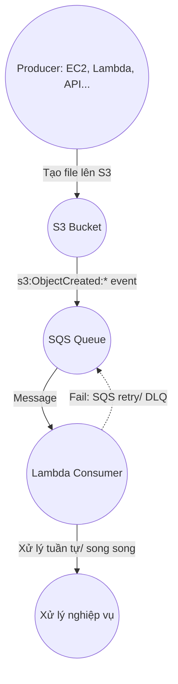

# I. AWS Lambda với LocalStack

AWS Lambda là một dịch vụ điện toán của Amazon cho phép bạn chạy hàm (function) dựa trên sự kiện, mà không cần triển khai hoặc quản lý máy chủ (serverless).

### Các sự kiện mà S3 hỗ trợ trigger

| Sự kiện                        | Mô tả                                         |
|--------------------------------|-----------------------------------------------|
| s3:ObjectCreated:*             | Bất kỳ khi nào một object mới được tạo (phổ biến nhất) |
| s3:ObjectCreated:Put           | Khi upload file bằng lệnh PUT                 |
| s3:ObjectCreated:Post          | Upload qua form HTML                          |
| s3:ObjectCreated:Copy          | Khi một object được sao chép                  |
| s3:ObjectCreated:CompleteMultipartUpload | Khi upload nhiều phần hoàn tất         |
| s3:ObjectRemoved:*             | Khi object bị xoá                             |
| s3:ObjectRemoved:Delete        | Xoá bằng lệnh DELETE                          |
| s3:ObjectRemoved:DeleteMarkerCreated | Khi tạo delete marker (phiên bản hoá)   |
---

## Hướng dẫn tạo Lambda đơn giản với LocalStack

### 1. Cấu hình AWS CLI (dùng fake credentials)
```bash
aws configure
# AWS Access Key ID: test
# AWS Secret Access Key: test
# Default region name: us-east-1
```

### 2. Tạo S3 bucket
```bash
aws --endpoint-url=http://localhost:4566 s3api create-bucket --bucket demo-bucket
```

### 3. Đóng gói Lambda thành file zip
```bash
zip function.zip lambda_function.py
```

### 4. Tạo Lambda function
```bash
aws --endpoint-url=http://localhost:4566 lambda create-function \
  --function-name my-s3-lambda \
  --runtime python3.9 \
  --handler lambda_function.lambda_handler \
  --role arn:aws:iam::000000000000:role/fake-role \
  --zip-file fileb://function.zip \
  --region us-east-1
```

### 5. Gắn trigger từ S3 → Lambda
```bash
aws --endpoint-url=http://localhost:4566 s3api put-bucket-notification-configuration \
  --bucket demo-bucket \
  --notification-configuration '{
    "LambdaFunctionConfigurations": [
      {
        "LambdaFunctionArn": "arn:aws:lambda:us-east-1:000000000000:function:my-s3-lambda",
        "Events": ["s3:ObjectCreated:*"]
      }
    ]
  }'
```

### 6. Kiểm tra trigger đã được gắn thành công chưa
```bash
aws --endpoint-url=http://localhost:4566 s3api get-bucket-notification-configuration \
  --bucket demo-bucket
```

### 7. Tạo file test và upload lên S3 bucket
```bash
echo "Hello LocalStack" > test.txt
aws --endpoint-url=http://localhost:4566 s3 cp test.txt s3://demo-bucket/test.txt
```

> **Lưu ý:**
> LocalStack log sẽ in trong terminal nội dung `print` trong `lambda_function.py` khi Lambda được kích hoạt.

# II. AWS SQS với LocalStack

Amazon SQS (Simple Queue Service) là một dịch vụ hàng đợi tin nhắn (message queue) dùng để truyền thông tin giữa các hệ thống một cách an toàn, tách biệt và không đồng bộ.

---

## Tình huống thực tế
Giả sử nhiều luồng (thread) hoặc hệ thống cùng lúc tạo nhiều file lên một bucket S3, và bạn muốn trigger một Lambda function khi mỗi file được tạo.

## Vấn đề nếu không có SQS
Nếu S3 kích hoạt trực tiếp Lambda, khi số lượng sự kiện lớn trong thời gian ngắn (burst), có thể xảy ra:
- Lambda bị giới hạn số lượng concurrent executions.
- Một số sự kiện bị mất nếu Lambda không kịp xử lý.
- Không có cơ chế retry nếu Lambda bị lỗi.

**Giải pháp:** Dùng SQS làm trung gian. Bạn cấu hình S3 gửi event vào một hàng đợi SQS, sau đó thiết lập Lambda để consume từ SQS.

## Luồng hoạt động tổng quát



- Nhiều luồng tạo file lên S3 (ví dụ PUT file).
- Mỗi `s3:ObjectCreated:*` event sẽ được gửi vào hàng đợi SQS.
- Lambda được thiết lập để nhận message từ hàng đợi này.
- Lambda sẽ xử lý tuần tự hoặc song song tùy cấu hình.
- Nếu Lambda fail, SQS sẽ retry (theo cấu hình retry & DLQ).
- Đảm bảo event không bị mất và có thứ tự xử lý nếu cần.
## Cách làm với localstack

### 0. Tạo S3 bucket
```bash
aws --endpoint-url=http://localhost:4566 s3api create-bucket --bucket demo-bucket
```

### 1. Tạo SQS queue:

```bash
    aws --endpoint-url=http://localhost:4566 sqs create-queue \
  --queue-name my-s3-event-queue
```
### 2. Lấy Amazon resource name(ARN) của queue:

- Dùng để kiểm tra queue đã được tạo chưa.
```bash
    aws --endpoint-url=http://localhost:4566 sqs get-queue-attributes \
    --queue-url http://localhost:4566/000000000000/my-s3-event-queue \
    --attribute-names QueueArn
```

### 3. Cấu hình bucket gửi event vào SQS:

```bash
    aws --endpoint-url=http://localhost:4566 s3api put-bucket-notification-configuration \
    --bucket demo-bucket \
    --notification-configuration '{
        "QueueConfigurations": [
        {
            "QueueArn": "arn:aws:sqs:us-east-1:000000000000:my-s3-event-queue",
            "Events": ["s3:ObjectCreated:*"]
        }
        ]
    }'

```

### 4. Tạo Lambda function.

```bash
    aws --endpoint-url=http://localhost:4566 lambda create-function \
    --function-name my-sqs-lambda \
    --runtime python3.9 \
    --handler lambda_function.lambda_handler \
    --role arn:aws:iam::000000000000:role/fake-role \
    --zip-file fileb://function.zip \
    --region us-east-1
```

### 5. Gán trigger SQS → Lambda

```bash
    aws --endpoint-url=http://localhost:4566 lambda create-event-source-mapping \
  --function-name my-sqs-lambda \
  --batch-size 1 \
  --event-source-arn arn:aws:sqs:us-east-1:000000000000:my-s3-event-queue \
  --region us-east-1

```

# III. CloudWatch logs

CloudWatch = "hệ thống giám sát trung tâm" của AWS

-Biết app có đang hoạt động bình thường không

-Tìm log khi lỗi xảy ra

-Tự động cảnh báo nếu có vấn đề
---
## Bước 1: Tạo Role giả với quyền CloudWatch logs

```bash
    aws --endpoint-url=http://localhost:4566 iam create-role \
    --role-name fake-role \
    --assume-role-policy-document '{
      "Version": "2012-10-17",
      "Statement": [
        {
          "Effect": "Allow",
          "Principal": {
            "Service": "lambda.amazonaws.com"
          },
          "Action": "sts:AssumeRole"
        }
      ]
    }'

```

## Bước 2: Gán policy cho role

```bash
  aws --endpoint-url=http://localhost:4566 iam put-role-policy \
  --role-name fake-role \
  --policy-name cloudwatch-policy \
  --policy-document '{
    "Version": "2012-10-17",
    "Statement": [
      {
        "Effect": "Allow",
        "Action": [
          "logs:CreateLogGroup",
          "logs:CreateLogStream",
          "logs:PutLogEvents"
        ],
        "Resource": "*"
      }
    ]
  }'
  
```
## Bước 3 xem log
```bash
  aws --endpoint-url=http://localhost:4566 logs describe-log-groups
  aws --endpoint-url=http://localhost:4566 logs describe-log-streams --log-group-name /aws/lambda/my-sqs-lambda
  STREAM_NAME=$(aws --endpoint-url=http://localhost:4566 logs describe-log-streams \
  --log-group-name /aws/lambda/my-sqs-lambda \
  --order-by LastEventTime --descending \
  --query 'logStreams[0].logStreamName' \
  --output text)
  echo $STREAM_NAME
  aws --endpoint-url=http://localhost:4566 logs get-log-events \
  --log-group-name /aws/lambda/my-sqs-lambda \
  --log-stream-name "$STREAM_NAME"
```
## Tự động cảnh báo nếu có vấn đề
### Local stack không có tính năng tự động cảnh báo trong thực tế sẽ dùng Create Alarm trong aws

# IV. API Gateway 
-Tiếp nhận các yêu cầu (HTTP/REST/WebSocket) từ client (như trình duyệt, app mobile),

-Chuyển tiếp yêu cầu đó tới các dịch vụ backend như AWS Lambda, S3, EC2, hoặc bất kỳ API nào,

-Quản lý truy cập, bảo mật, giới hạn tốc độ (rate limit), logging, và nhiều tính năng khác.

## Deploy Lambda vào LocalStack:

```bash
  aws --endpoint-url=http://localhost:4566 lambda create-function \
  --function-name hello-lambda \
  --runtime python3.9 \
  --handler hello.handler \
  --role arn:aws:iam::000000000000:role/lambda-role \
  --zip-file fileb://hello.zip
```
## Tạo REST API Gateway
```bash
  aws --endpoint-url=http://localhost:4566 apigateway create-rest-api \
  --name "MyApi"
```

